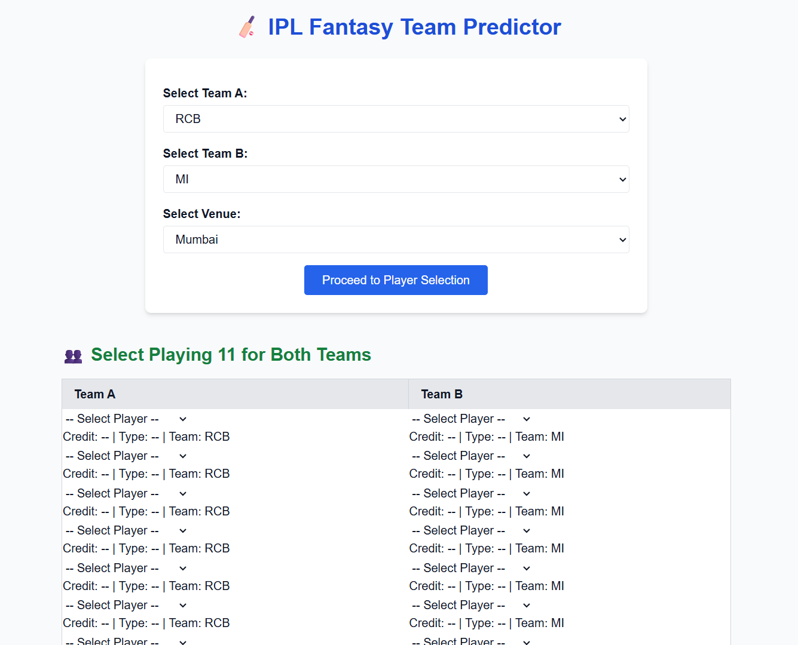
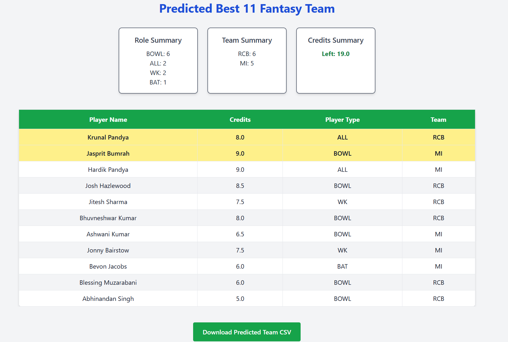
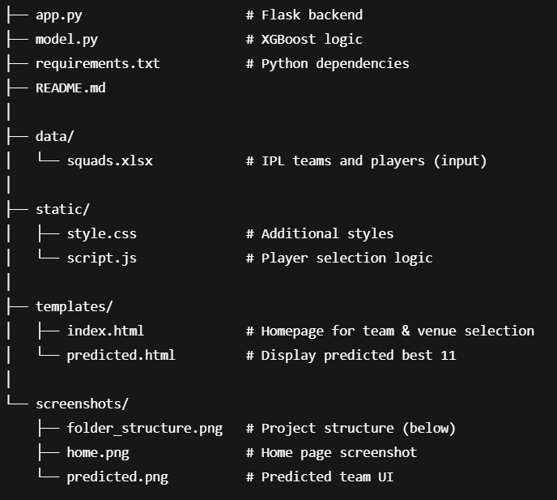

# 🏏 IPL Fantasy Team Predictor

A web application that helps users generate the **best 11 fantasy cricket team** from a given set of 22 players, using **historical IPL data** and **machine learning** (XGBoost). The application provides role- and team-balanced predictions optimized for fantasy points.

## 🔍 Features

- 🧠 **ML-based Predictions**: Trained using historical IPL performance and fantasy points.
- ⚙️ **Custom Team Selection**: Choose any 11 players from both teams for prediction.
- 📊 **Venue-based Intelligence**: Incorporates venue performance into the model.
- 🧮 **Role & Team Diversity**: Ensures all key roles (WK, BAT, ALL, BOWL) are present.
- 📥 **Excel Integration**: Generates an Excel input file based on player selections.
- 💡 **Clean UI**: Fully responsive, modern interface with TailwindCSS.
- 📦 **CSV Download**: Download the predicted team as a CSV file.

---

## 📸 Screenshots

| Home Page                      | Predicted Team                   |
|----------------------------|----------------------------------|
|  |  |

---

## 📂 Data Source

The model is trained on a **custom IPL fantasy dataset that was created by the Author** from raw match commentary data. It includes player stats, fantasy points, and venue-specific performance metrics.

👉 Dataset Repository: [Saatu23/t20-fantasy-dataset](https://github.com/Saatu23/t20-fantasy-dataset)

The dataset was created by the project author using custom parsing and transformation from raw match commentary data.

---
## 🚀 Tech Stack

- **Frontend**: HTML, TailwindCSS, JavaScript
- **Backend**: Python, Flask
- **ML Model**: XGBoost
- **Data**: Historical player stats (from GitHub CSV), Venue data

---

## 🛠️ Setup Instructions

### 1. Clone the repository
```bash
git clone https://github.com/Saatu23/ipl-fantasy-predictor.git
cd ipl-fantasy-predictor
```
### 2. create and activate 
```
conda create -n fantasy_env python=3.9
conda activate fantasy_env
```
### 3. install dependencies
```
pip install -r requirements.txt
```

### 4. run the application
```
python app.py
```

---


## 📁 Project Structure



---
### 🙋‍♂️ Author

**Satyam Kumar Mishra**  
📧 satyammishra20102004@gmail.com  
🔗 [GitHub](https://github.com/Saatu23)
